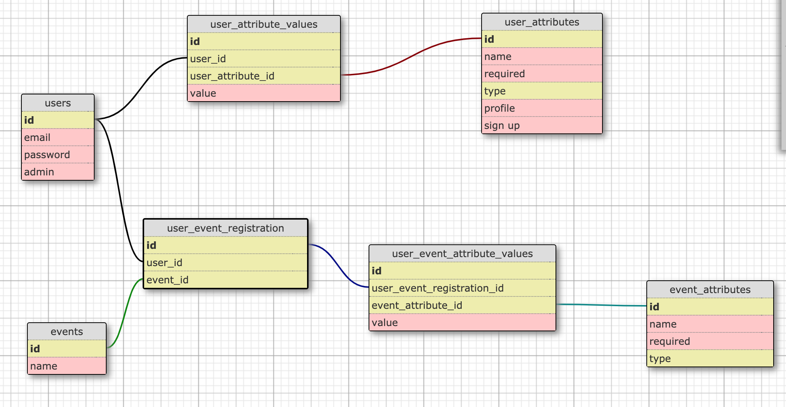

# README

This is an app created in the context of [the Hivebrite Backend technical test](https://github.com/Hivebrite/hivebrite_backend_test).

* I created models and table associations according to the DB schema (see this image below) I deducted from the user stories described. I included basic validations and some scope.
* Associations and validations are tested with Rspec and Shoulda-Matchers gems (``bundle exec rspec``).
* Admin rights are partially coded and tested with Pundit : Only event_attributes and user_attributes CRUDs are protected, for now. Also, a ``record.user == user`` should probably be added.
* I tried to find a way to display examples values in the seed, to have a glimpse of the way a form would be implemented. Only User profile form and User sign up form is displayed (``rails db:seed``). This logic may be used to create a Service that would reach all the necessary tables associations in order to simplify the forms set up in the view
* When an admin create a user_attribute, I think a sort of validation or maybe a method sould check that at least one of the ``:profile`` or ``:signup`` attribute is set to ``true``. Otherwise, the attribute created would not appear either in the profile form nor the signup form.

## Database Schema

